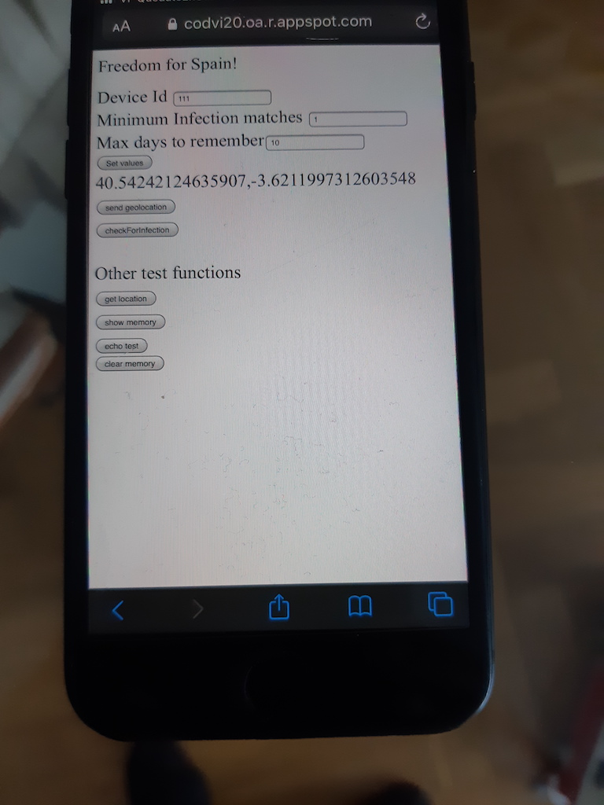

# A simple demo

## First device
With id=111
Position as shown in picture

## Second device
With id=333 and location shown in the picture (close to the other one).

## Hospital reports an infection
Of the device 111

## Second device reports risk to user
As it was close to the other device.

## Notes
So simple.

No info is stored in servers. There is only info of matching ids inside
the devices.

Yo see a lot of buttons: because it's a PROTOTYPE and all the functionallity
is open to be controlled by user. No timers at this moment.
